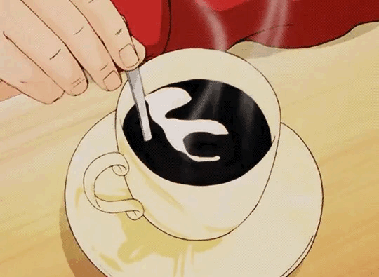

<h3 align=center> Hi there!  </h3>

  

 

  
 I'm Italo, a self-motivated front-end web development student and a tech-savvy! 💻 

  
<strong>🌱 Currently improving vanilla JavaScript skills | 💭 Ping me about front-end, web design. <strong>
 

##

  
  
  
  
  

 

  <a href="https://github.com/itsguim">
   
  

## Reach me:

  
  
    

  
